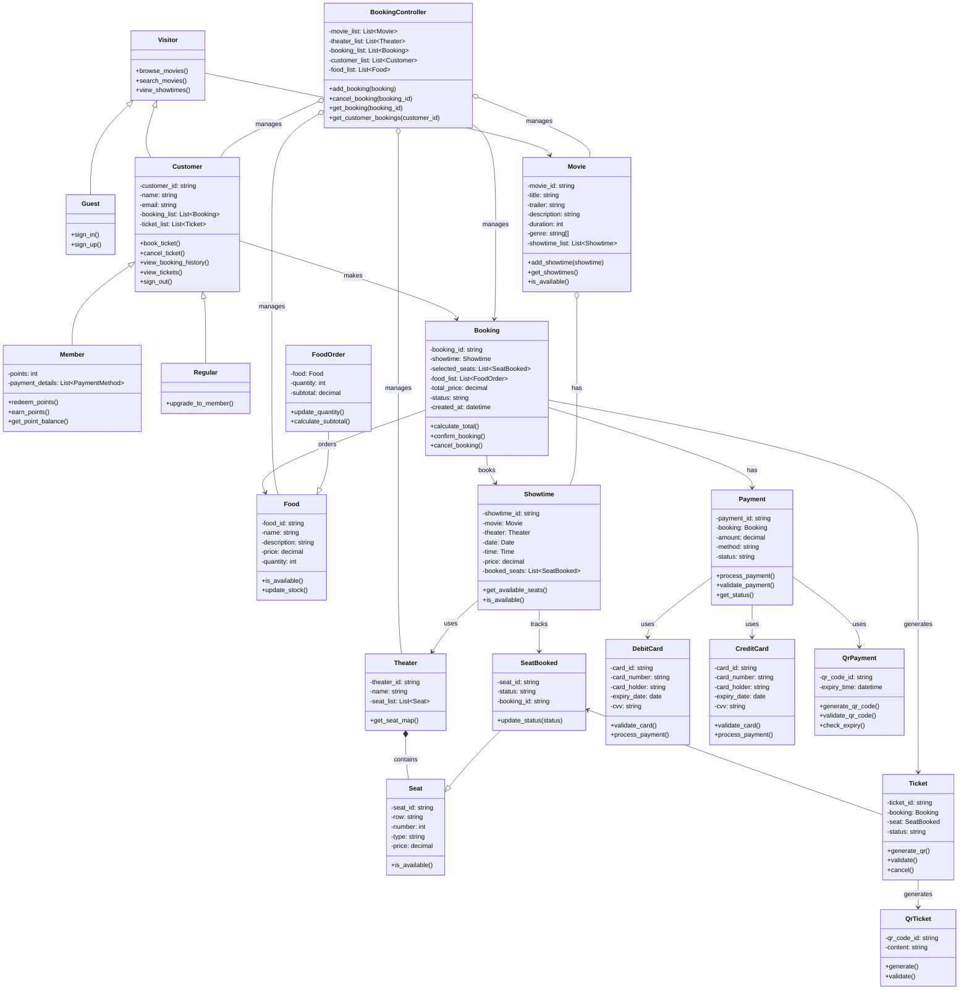

```mermaid
classDiagram
    %% User Management
    Visitor <|-- Guest
    Visitor <|-- Customer
    Customer <|-- Member
    Customer <|-- Regular

    %% Booking Flow
    Customer --> Booking : makes
    Visitor --> Movie : search
    Booking --> Food : orders
    Booking --> Showtime : books
    BookingController --> Booking : manages
    BookingController o-- Movie : manages
    BookingController o-- Theater : manages
    BookingController o-- Customer : manages
    BookingController o-- Food : manages

    %% Theater Management
    Theater *-- Seat : contains
    SeatBooked --|> Seat
    SeatBooked <-- Ticket
    Showtime --> Theater : uses
    Showtime --> SeatBooked : tracks
    Movie o-- Showtime : has
    FoodOrder --|> Food

    %% Payment Flow
    Booking --> Payment : has
    Booking --> Ticket : generates
    Ticket --> QrTicket : generates
    Payment --> DebitCard : uses
    Payment --> CreditCard : uses
    Payment --> QrPayment : uses

    class BookingController{
        -movie_list: List~Movie~
        -theater_list: List~Theater~
        -booking_list: List~Booking~
        -customer_list: List~Customer~
        -food_list: List~Food~
        +add_booking(booking)
        +cancel_booking(booking_id)
        +get_booking(booking_id)
        +get_customer_bookings(customer_id)
    }

    class Movie{
        -movie_id: string
        -title: string
        -trailer: string
        -description: string
        -duration: int
        -genre: string[]
        -showtime_list: List~Showtime~
        +add_showtime(showtime)
        +get_showtimes()
        +is_available()
    }

    class Showtime {
        -showtime_id: string
        -movie: Movie
        -theater: Theater
        -date: Date
        -time: Time
        -price: decimal
        -booked_seats: List~SeatBooked~
        +get_available_seats()
        +is_available()
    }

    class Theater {
        -theater_id: string
        -name: string
        -seat_list: List~Seat~
        +get_seat_map()
    }

    class Seat{
        -seat_id: string
        -row: string
        -number: int
        -type: string
        -price: decimal
        +is_available()
    }

    class SeatBooked {
        -seat_id: string
        -status: string
        -booking_id: string
        +update_status(status)
    }

    class Booking{
        -booking_id: string
        -showtime: Showtime
        -selected_seats: List~SeatBooked~
        -food_list: List~FoodOrder~
        -total_price: decimal
        -status: string
        -created_at: datetime
        +calculate_total()
        +confirm_booking()
        +cancel_booking()
    }

    class FoodOrder{
        -food: Food
        -quantity: int
        -subtotal: decimal
        +update_quantity()
        +calculate_subtotal()
    }

    class Food{
        -food_id: string
        -name: string
        -description: string
        -price: decimal
        -quantity: int
        +is_available()
        +update_stock()
    }

    class Ticket{
        -ticket_id: string
        -booking: Booking
        -seat: SeatBooked
        -status: string
        +generate_qr()
        +validate()
        +cancel()
    }

    class QrTicket{
        -qr_code_id: string
        -content: string
        +generate()
        +validate()
    }

    class Payment{
        -payment_id: string
        -booking: Booking
        -amount: decimal
        -method: string
        -status: string
        +process_payment()
        +validate_payment()
        +get_status()
    }

    class QrPayment{
        -qr_code_id: string
        -expiry_time: datetime
        +generate_qr_code()
        +validate_qr_code()
        +check_expiry()
    }

    class DebitCard{
        -card_id: string
        -card_number: string
        -card_holder: string
        -expiry_date: date
        -cvv: string
        +validate_card()
        +process_payment()
    }

    class CreditCard{
        -card_id: string
        -card_number: string
        -card_holder: string
        -expiry_date: date
        -cvv: string
        +validate_card()
        +process_payment()
    }

    class Visitor{
        +browse_movies()
        +search_movies()
        +view_showtimes()
    }

    class Guest{
        +sign_in()
        +sign_up()
    }

    class Customer {
        -customer_id: string
        -name: string
        -email: string
        -booking_list: List~Booking~
        -ticket_list: List~Ticket~
        +book_ticket()
        +cancel_ticket()
        +view_booking_history()
        +view_tickets()
        +sign_out()
    }

    class Member{
        -points: int
        -payment_details: List~PaymentMethod~
        +redeem_points()
        +earn_points()
        +get_point_balance()
    }

    class Regular{
        +upgrade_to_member()
    }
```
 

