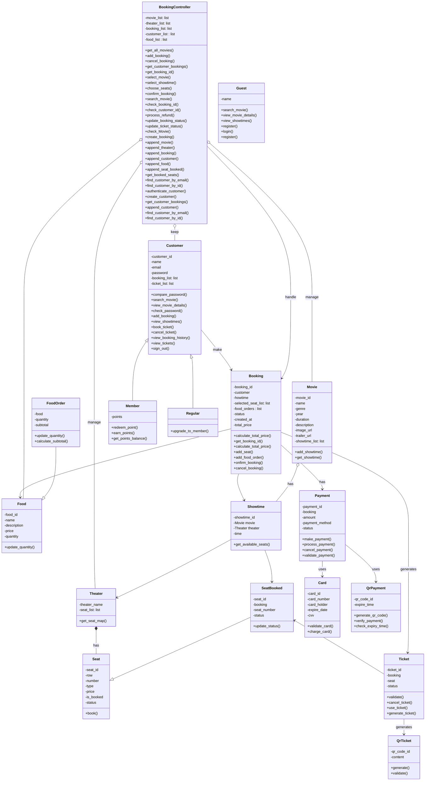

```mermaid
classDiagram

    %% AuthControllers
    Customer --> Booking : make
    Booking --> Food

    Booking --> Showtime

    BookingController o-- Food

    %% Booking and Payment System
    BookingController --> Booking : handle
    BookingController o-- Movie : manage
    BookingController o-- Theater : manage
    BookingController o-- Customer : keep

    Theater *-- Seat : has
    SeatBooked --|> Seat
    SeatBooked <-- Ticket
    Showtime --> Theater 
    Showtime --> SeatBooked
    Movie o-- Showtime : has
    FoodOrder --|> Food


    Booking --> Payment : has
    Booking --> Ticket : generates
    Ticket --> QrTicket : generates

    Payment --> Card : uses
    Payment --> QrPayment : uses


    %%User Roles and Authentication
    Customer <|-- Member
    Customer <|-- Regular


    class BookingController{
        -movie_list: list
        -theater_list: list
        -booking_list: list
        -customer_list : list
        -food_list : list
        +get_all_movies()
        +add_booking()
        +cancel_booking()
        +get_customer_bookings()
        +get_booking_id()
        +select_movie()
        +select_showtime()
        +choose_seats()
        +confirm_booking()
        +search_movie()
        +check_booking_id()
        +check_customer_id()
        +process_refund()
        +update_booking_status()
        +update_ticket_status()
        +check_Movie()
        +create_booking()
        +append_movie()
        +append_theater()
        +append_booking()
        +append_customer()
        +append_food()
        +append_seat_booked()
        +get_booked_seats()
        +find_customer_by_email()
        +find_customer_by_id()
        +authenticate_customer()
        +create_customer()
        +get_customer_bookings()
        +append_customer()
        +find_customer_by_email()
        +find_customer_by_id()
    }
    
    class Movie{
        -movie_id
        -name
        -genre
        -year
        -duration
        -description
        -image_url
        -trailer_url
        -showtime_list: list
        +add_showtime()
        +get_showtime()
    }

    class Showtime{
        -showtime_id
        -Movie movie
        -Theater theater
        -time
        +get_available_seats()
    }

    class Theater{
        -theater_name
        -seat_list: list
        +get_seat_map()
    }

    class Seat{
        -seat_id
        -row
        -number
        -type
        -price
        -is_booked
        -status
        +book()
    }

    class SeatBooked{
        -seat_id
        -booking
        -seat_number
        -status
        +update_status()
    }

    class Booking{
        -booking_id
        -customer
        -howtime
        -selected_seat_list: list
        -food_orders : list
        -status
        -created_at
        -total_price
        +calculate_total_price()
        +get_booking_id()
        +calculate_total_price()
        +add_seat()
        +add_food_order() 
        +onfirm_booking()
        +cancel_booking()

    }

    class Food{
        -food_id
        -name
        -description
        -price
        -quantity
        +update_quantity()
    }

    class FoodOrder{
        -food
        -quantity
        -subtotal
        +update_quantity()
        +calculate_subtotal()
    }

    class Ticket{
        -ticket_id
        -booking
        -seat
        -status
        +validate()
        +cancel_ticket()
        +use_ticket()
        +generate_ticket()
    }

    class QrTicket{
        -qr_code_id
        -content
        +generate()
        +validate()
    }

    class Payment{
        -payment_id
        -booking
        -amount
        -payment_method
        -status
        +make_payment()
        +process_payment()
        +cancel_payment()
        +validate_payment()
    }

    class QrPayment{
        -qr_code_id
        -expire_time
        +generate_qr_code()
        +verify_payment()
        +check_expiry_time()
    }

    class Card{
        -card_id
        -card_number
        -card_holder
        -expire_date
        -cvv
        +validate_card()
        +charge_card()
    }

    class Guest{
        -name
        +search_movie()
        +view_movie_details()
        +view_showtimes()
        +register()
        +login()
        +register()
    }

    class Customer {
        -customer_id
        -name
        -email
        -password
        -booking_list: list
        -ticket_list: list
        +compare_password()
        +search_movie()
        +view_movie_details()
        +check_password()
        +add_booking()
        +view_showtimes()
        +book_ticket()
        +cancel_ticket()
        +view_booking_history()
        +view_tickets()
        +sign_out()
    }

    class Member{
        -points
        +redeem_point()
        +earn_points()
        +get_points_balance()
    }

    class Regular{
        +upgrade_to_member()
    }
```
