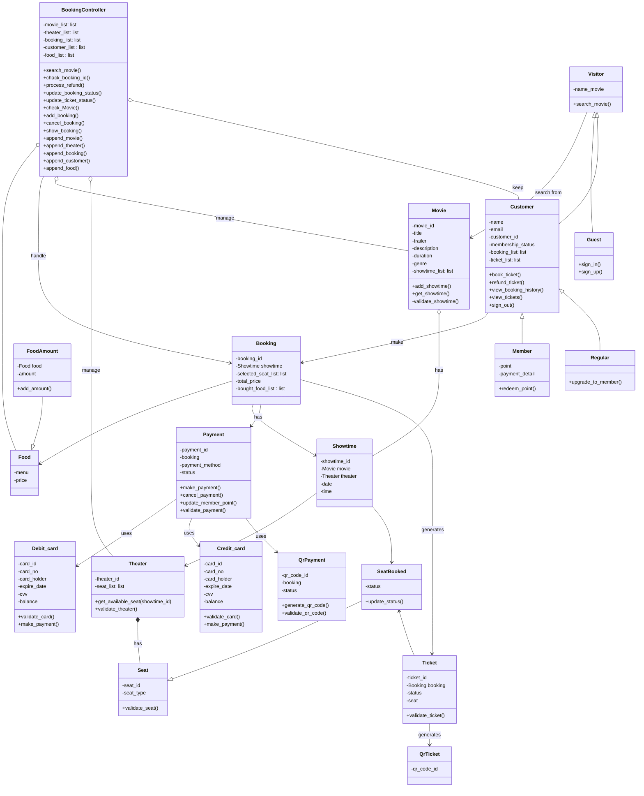

<!-- Movies Ticket Reserved System -->

<!-- customer info in booking controller, booking delete status, seat might be used again but status still not change + add date to teater/seat? -->

```mermaid
classDiagram

    %% AuthControllers
    Customer --> Booking : make
    Booking --> Food
    Visitor --> Movie : search from

    Booking --> Showtime

    BookingController o-- Food

    %% Booking and Payment System
    BookingController --> Booking : handle
    BookingController o-- Movie : manage
    BookingController o-- Theater : manage
    BookingController o-- Customer : keep

    Theater *-- Seat : has
    SeatBooked --|> Seat
    SeatBooked <-- Ticket
    Showtime --> Theater 
    Showtime --> SeatBooked
    Movie o-- Showtime : has
    FoodAmount --|> Food


    Booking --> Payment : has
    Booking --> Ticket : generates
    Ticket --> QrTicket : generates

    Payment --> Debit_card : uses
    Payment --> Credit_card : uses
    Payment --> QrPayment : uses


    %%User Roles and Authentication
    Visitor <|-- Guest
    Visitor <|-- Customer
    Customer <|-- Member
    Customer <|-- Regular


    class BookingController{
        -movie_list: list
        -theater_list: list
        -booking_list: list
        -customer_list : list
        -food_list : list
        +search_movie()
        +chack_booking_id()
        +process_refund()
        +update_booking_status()
        +update_ticket_status()
        +check_Movie()
        +add_booking()
        +cancel_booking()
        +show_booking()
        +append_movie()
        +append_theater()
        +append_booking()
        +append_customer()
        +append_food()
    }
    
    class Movie{
        -movie_id
        -title
        -trailer
        -description
        -duration
        -genre
        -showtime_list: list
        +add_showtime()
        +get_showtime()
        -validate_showtime()
    }

    class Showtime{
        -showtime_id
        -Movie movie
        -Theater theater
        -date
        -time
    }

    class Theater{
        -theater_id
        -seat_list: list
        +get_available_seat(showtime_id)
        +validate_theater()
    }

    class Seat{
        -seat_id
        -seat_type
        +validate_seat()
    }

    class SeatBooked{
        -status
        +update_status()
    }

    class Booking{
        -booking_id
        -Showtime showtime
        -selected_seat_list: list
        -total_price
        -bought_food_list : list
    }

    class FoodAmount{
        -Food food
        -amount
        +add_amount()
    }

    class Ticket{
        -ticket_id
        -Booking booking
        -status
        -seat
        +validate_ticket()
    }

    class QrTicket{
        -qr_code_id
    }

    class Payment{
        -payment_id
        -booking
        -payment_method
        -status
        +make_payment()
        +cancel_payment()
        +update_member_point()
        +validate_payment()
    }

    class QrPayment{
        -qr_code_id
        -booking
        -status
        +generate_qr_code()
        +validate_qr_code()
    }

    class Debit_card{
        -card_id
        -card_no
        -card_holder
        -expire_date
        -cvv
        -balance
        +validate_card()
        +make_payment()
    }

    class Credit_card{
        -card_id
        -card_no
        -card_holder
        -expire_date
        -cvv
        -balance
        +validate_card()
        +make_payment()
    }

    class Visitor{
        -name_movie
        +search_movie()
    }

    class Guest{
        +sign_in()
        +sign_up()
    }

    class Customer {
        -name
        -email
        -customer_id
        -membership_status
        -booking_list: list
        -ticket_list: list
        +book_ticket()
        +refund_ticket()
        +view_booking_history()
        +view_tickets()
        +sign_out()
    }

    class Member{
        -point
        -payment_detail
        +redeem_point()
    }

    class Regular{
        +upgrade_to_member()
    }

    class Food{
        -menu
        -price
    }
```
